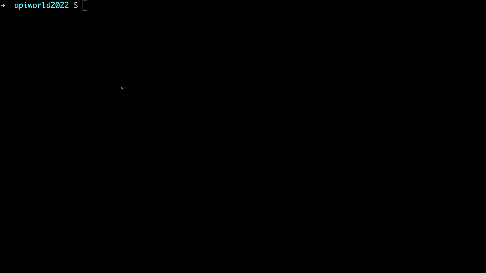

# api-world-22-pinejs

# API World 2022 PineJS Example Repository

This repository consists of a step by step pinejs exploration. Each step is a single independent node application that runs pinejs as a application server and demonstrates queries to the application server. The data models and configurations in each step build on top of the previous step but are executable self contained.

# Examples contained in this repository

## 01-basics

Basic data model with relations on resources. No constraints.
Showcasing AXIOS odata request to the running pinejs application server

## 02-constraints

Basic data model wth relations on resources. Data and relation constraints.
Showcasing AXIOS odata request to the running pinejs application server

## 03-role-permissions

Basic data model wth relations on resources.
Added role bases permissions. Showcasing AXIOS odata request to the running pinejs application server with different user roles

## 04-row-permissions

TBD

# Prerequisites

docker environment with `docker compose` plugin installed. This is needed as this pinejs examples need a postgres database. There is a docker-compose.yml which defines the test database as a postgres service. The `docker compose` commands don't need to be run manually and are triggered by the npm scripts.

# Run the examples

The npm scripts will spin up the database with a `docker compose up` command, execute the example code and odata requests and close the example by calling `docker compose down` to cleanup.

## 01-basics


```
git clone https://github.com/fisehara/api-world-22-pinejs
cd api-world-22-pinejs
npm install
npm run 01-basics
```




## Help

1. When stopping the execution with SIGINT (strg-c) the docker compose down trap is called. But when the SIGINT is called to often, the trap is exited without calling docker compose down. Maybe this will leave a postgres db service running that you don't need.
